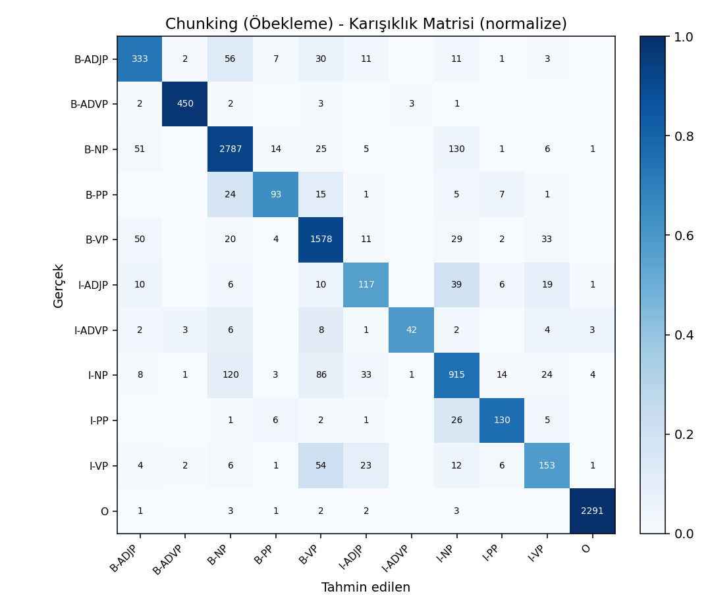
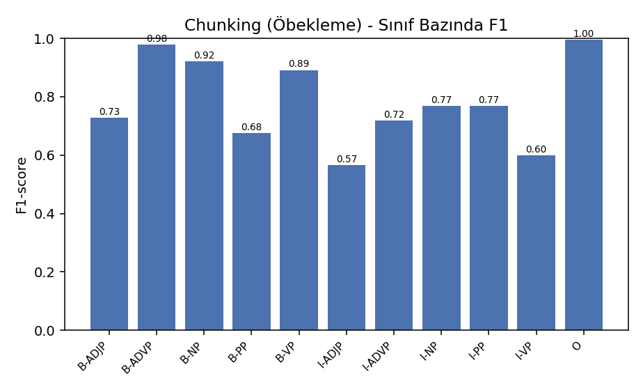

<h1 align="center">Turkish Chunking — Phrase and Clause Detection with CRF</h1>

<p align="center">
  <b>Natural Language Processing Project</b><br>
  Bursa Technical University · Computer Engineering · 2025–2026 Spring
</p>

<p align="center">
  
  
  
  
  
  
</p>

---

A **shallow parsing (chunking)** system for Turkish, built on **Conditional Random Fields**. Given a
Turkish sentence, it automatically tags **noun (NP), verb (VP), adjective (ADJP), adverb (ADVP) and
postpositional (PP) phrases**, along with **subordinate clauses** (RELCL / COMPCL / ADVCL). All
labelling follows the **CoNLL / BIO** format.

## Contents
- [Features](#features)
- [Quick Start](#quick-start)
- [Results](#results)
- [How It Works](#how-it-works)
- [Project Structure](#project-structure)
- [Sample Output](#sample-output)

## Features

- **5 phrase types** (NP, VP, ADJP, ADVP, PP) plus **3 clause types** (RELCL, COMPCL, ADVCL)
- **Statistical sequence labelling** with Conditional Random Fields
- **End-to-end pipeline**: raw sentence → POS → CHUNK → CLAUSE
- Automatic **precision / recall / F1 / accuracy**, confusion matrices and plots
- Trained on real data: the **Universal Dependencies Turkish-IMST** treebank

## Quick Start

```bash
# 1) Install dependencies
pip install -r requirements.txt

# 2) Full pipeline: download → convert → train → evaluate
python src/run_all.py

# 3) Chunk a raw sentence
python src/predict.py "Dün akşam toplantıdan erken çıkan öğrenci eve gitti."
```

> On Windows you can run **`calistir.bat`** instead to execute the whole pipeline in one step.

## Results

Evaluated on a held-out test set of 1,100 sentences / 10,032 tokens.

| Task | Token Accuracy | Phrase F1 |
|------|:---:|:---:|
| **Chunking** (gold POS) | **88.6%** | **0.838** |
| Chunking (end-to-end, predicted POS) | 82.4% | 0.756 |
| POS tagging | 91.2% | — |
| Clause detection | 78.6% | 0.278 |

<p align="center">
  
  
</p>

**Reading these numbers.** Chunking with gold POS tags reaches 0.838 F1; swapping in predicted POS
costs about 8 points of F1, which is the expected error-propagation penalty from the 91.2% POS
tagger. Clause detection is the clear weak point: token accuracy looks reasonable at 78.6%, but a
span-level F1 of 0.278 shows the model rarely gets a full clause boundary right. Clause spans are
long and comparatively rare in the treebank, so the CRF tends to under-segment them — this is the
most promising area for future work.

## How It Works

```
UD Turkish-IMST (CoNLL-U)
        │  conllu_to_chunks.py  (dependency tree → BIO tags)
        ▼
data/chunks/*.conll  (ID FORM UPOS CHUNK CLAUSE)
        │  features.py  (word, prefixes/suffixes, shape, UPOS, ±2 context)
        ▼
   CRF training (train.py)  →  models/*.pkl
        │
        ▼
   Evaluation (evaluate.py) → results/  ·  Prediction (predict.py)
```

- **Data.** Phrase and clause BIO labels are derived from the dependency parses in the UD
  Turkish-IMST treebank using deterministic grammatical rules.
- **Features.** Lowercased form, 1–4 character prefixes and suffixes, word shape, capitalisation
  flags, UPOS tag, and a ±2 token context window.
- **Model.** CRF via `sklearn-crfsuite`, trained with L-BFGS and L1/L2 regularisation.

## Project Structure

```
.
├── src/
│   ├── download_data.py        # Fetch the UD treebank
│   ├── conllu_to_chunks.py     # CoNLL-U → Chunk CoNLL (BIO)
│   ├── features.py             # Feature extraction
│   ├── train.py                # CRF training (pos, chunk, clause)
│   ├── evaluate.py             # Metrics, confusion matrix, plots
│   ├── predict.py              # Raw sentence → phrases (demo)
│   └── run_all.py              # End-to-end pipeline
├── data/
│   ├── ud/                     # Raw UD treebank (CoNLL-U)
│   └── chunks/                 # Labelled data (CoNLL/BIO)
├── models/                     # Trained CRF models (.pkl)
├── results/                    # Metrics (.txt) and plots (.png)
├── report.pdf                  # Full project report
├── requirements.txt
└── calistir.bat                # One-click pipeline runner for Windows
```

## Sample Output

```
$ python src/predict.py "Dün akşam toplantıdan erken çıkan öğrenci eve gitti."
  ("The student who left the meeting early last night went home.")

# columns = ID FORM UPOS CHUNK CLAUSE
1  Dün          NOUN   B-NP    B-RELCL
2  akşam        NOUN   B-NP    I-RELCL
3  toplantıdan  NOUN   B-NP    I-RELCL
4  erken        ADV    B-ADVP  I-RELCL
5  çıkan        VERB   B-VP    I-RELCL
6  öğrenci      ADJ    B-NP    O
7  eve          NOUN   I-NP    O
8  gitti        VERB   B-VP    O
9  .            PUNCT  O       O
```

## Tag Sets

- **CHUNK:** `B-` / `I-` prefixes over **NP, VP, ADJP, ADVP, PP**, plus `O`
- **CLAUSE:** `B-` / `I-` prefixes over **RELCL, COMPCL, ADVCL**, plus `O`

## License and Data

The source code is released under the [MIT License](LICENSE).

Training data is derived from the
[Universal Dependencies Turkish-IMST](https://github.com/UniversalDependencies/UD_Turkish-IMST)
treebank and remains under its original **CC BY-SA 4.0** licence. The MIT licence covers this
repository's code only, not the derived treebank data.

---
<p align="center"><sub>Mustafa Can Ersoy</sub></p>
